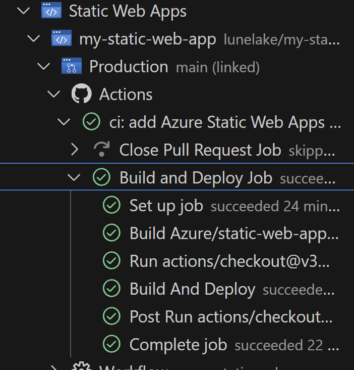

# Lab 05: Azure Static Web Apps를 사용하여 React 앱 게시

## 안내사항

## 실습 시나리오
이 실습에서는 클라이언트 애플리케이션을 선택한 후, 프런트 엔드 애플리케이션을 빌드 및 실행합니다. 또한, GitHub Actions를 통해 GitHub 리포지토리에서 웹앱을 자동으로 빌드하고 Azure에 배포합니다. 마지막으로, 애플리케이션을 탐색 및 시작하는 작업을 진행합니다.


### 연습 1: 리액트 앱을 Azure Static Web App에 게시

### 작업 1 : 리포지토리 만들기

[템플릿 만들기](https://github.com/new?template_name=mslearn-staticwebapp&template_owner=MicrosoftDocs)

1. GitHub 템플릿 리포지토리의 "만들기" 페이지로 이동합니다.  
    404 오류가 발생하면 GitHub에 로그인한 후 다시 시도합니다.

2. 소유자 드롭다운에서 본인의 GitHub 계정을 선택합니다.

3. 리포지토리 이름으로 my-static-web-app을 입력하고, 템플릿에서 **리포지토리 만들기** 단추를 선택합니다.

### 작업 2 : 앱 실행

1. 로컬 컴퓨터에서 터미널을 엽니다. cd (랩루트폴더)/Lab05/Start로 이동합니다.

2. 아래 명령을 실행하여 리포지토리를 복제합니다:

    ```bash
    git clone https://github.com/<YOUR_GITHUB_USERNAME>/my-static-web-app
    ```

3. VS Code를 새로 열어 `my-static-web-app`경로를 폴더 열기 합니다.
4. React 앱 폴더로 이동합니다:

    ```bash
    cd react-app
    ```

5. 애플리케이션 종속성을 설치합니다:

    ```bash
    npm install
    ```

    참고: PATH 에러가 발생하면 https://nodejs.org에서 Node.js 설치 여부 및 PATH 환경 설정을 확인합니다.

6. 아래 명령으로 애플리케이션을 실행합니다. 약간 시간이 걸립니다.:

    ```bash
    npm start
    ```

### 작업 3 : 앱으로 이동

1. 브라우저를 열고, http://localhost:3000 주소로 이동하여 로컬에서 실행되는 React 웹앱을 확인합니다.

2. 앱을 중지하려면 터미널 창에서 Ctrl-C를 눌러 실행 중인 프로세스를 종료합니다.


이제 GitHub 리포지토리를 만들었으므로 Azure Portal에서 Static Web Apps 인스턴스를 만들 수 있습니다.

### 작업 4 : "Azure Static Web Apps" 확장 설치


1. Visual Studio Marketplace에서 "Azure Static Web Apps" 확장을 설치합니다.
2. 설치가 완료되면 업데이트를 위해 Visual Studio Code를 재시작합니다.

### 작업 5 : 정적 웹앱 생성
1. Visual Studio Code의 활동 표시줄에서 Azure 아이콘을 클릭합니다.
2. Static Web Apps 영역에서 마우스 오른쪽 버튼을 클릭하고 "정적 웹앱 만들기"를 선택합니다.


3. 다음 정보를 차례로 입력합니다:
    - 웹앱 이름: staticwebapp[이름]
    - 위치: East Asia 선택
    - 기본 프로젝트 구조 : 리액트
    - 프론트엔드 코드 위치: /react-app
    - 빌드 출력 위치: build
    - React 옵션 선택
4. 생성 프로세스가 완료되면 Visual Studio Code에 확인 알림이 표시됩니다.
5. 아래 이미지 처럼 GitHub Actions의 파이프가 제대로 동작하였 지 확인합니다.

    


### 작업 6 : 배포 확인
- Visual Studio Code 확장 또는 GitHub Actions 탭에서 빌드 및 배포 상태를 확인합니다.
- 배포가 완료되면 Static Web Apps 확장에서 "사이트 찾아보기"를 선택하여 웹사이트에 접속할 수 있습니다.


### 연습 2 : Azure Static Web Apps에 API 게시

[템플릿 만들기]("https://github.com/new?template_name=mslearn-staticwebapp-api&template_owner=MicrosoftDocs")

## 리포지토리 만들기

1. GitHub 템플릿 생성 페이지로 이동합니다.
2. 템플릿 리포지토리를 엽니다.
3. 소유자 기본 선택 메시지가 표시되면 GitHub 계정 중 하나를 선택합니다.
4. 리포지토리 이름에 my-static-web-app-and-api를 입력하고, 템플릿에서 리포지토리 만들기를 선택합니다.
5. GitHub는 백그라운드에서 리포지토리를 빌드합니다.

## 로컬로 앱 실행

1. 컴퓨터에서 터미널 창을 엽니다 (Windows 사용 시, 시작 메뉴나 시스템 트레이 검색 상자에 cmd 입력). 터미널의 위치는 `Lab/Start`여야 합니다.
2. 다음 명령어를 실행하여 리포지토리를 복제합니다:
   
   ```bash
   git clone https://github.com/<YOUR_GITHUB_USERNAME>/my-static-web-app-and-api
   ```

3. 복제한 디렉터리로 이동합니다:

   ```bash
   cd my-static-web-app-and-api
   cd react-app
   ```

4. 애플리케이션 종속성을 설치합니다:

   ```bash
   npm install
   ```

5. 각 종속성의 최신 버전이 설치되어 있는지 확인하려면 다음 명령을 실행합니다:

   ```bash
   npm audit fix
   ```

## 앱으로 이동

1. 프런트 엔드 클라이언트 애플리케이션을 실행합니다:

   ```bash
   npm start
   ```

2. 애플리케이션 번들이 생성되고 컴파일되면, 브라우저 탭이 자동으로 열리며 http://localhost:3000에서 실행 중인 앱을 확인할 수 있습니다.


### 연습 2: Azure Static Web Apps에 API 게시 

